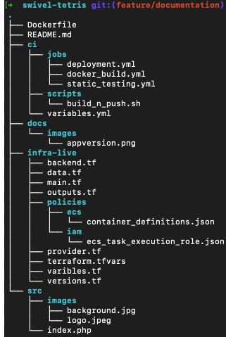
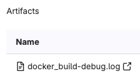

# Swivel-Tetris

## Overview
Since I am not familiar with .NET, I opted to use a PHP web application to showcase my DevOps knowledge. I have containerized the application and built a CI/CD pipeline incorporating best practices.
This is a small web-based Tetris game developed using PHP.

## Getting Started

### Prerequisites
- Git
- Docker

### Local Testing 
To get started with Swivel-Tetris, follow these steps:

1. Clone the repo:
   `git clone [repo_url]`
2. Navigate to the project directory:
    `cd swivel-tetris`
3. Build the Docker image:
    `docker build -t swivel-tetris .`
4. Run the Docker container in detached mode:
    `docker run -d -p 8080:80 swivel-tetris`
    
Now, you should be able to access the game at http://localhost:8080.

## Solution [ Answers for questions ]

### 1. Introducing Best Practices into the Solution to Ensure a High-Quality Deliverable and a Great Developer Experience

#### Version Control and Branching Strategy
- **Version Control and Branching Strategy:** Implemented a structured branching strategy where CI/CD deployment will only be triggered for the `main` branch to manage the workflow and ensure code quality and stability 
- **Versioning of Artifacts:** Utilizing semantic versioning and the `APP_VERSION` variable, along with `CI_COMMIT_SHA`, to generate unique Docker image tags. This approach helps track changes and ensures compatibility across artifacts 
  

- **Directory and file structure:** Adapted best practices in organizing the files and folders in this repository. The application source code, CI/CD configuration files, and Infrastructure as Code (IaC) files are all separated to maintain clarity and consistency in the project.
  

#### Continuous Integration (CI)
Implemented GitLab CI/CD pipelines to automate the integration process, ensuring that all code changes are automatically built and tested. [CI/CD pipeline will be comprehensively explained in this section] 
- **Build Automation:** Automating the build process to ensure consistency and efficiency in creating deliverable artifacts. 
- **Static Code Analysis:** Incoperated the following static code analysis tool to identify potential issues early in the development process.
   - **Hadolint**: Integrated Hadolint to analyze Dockerfiles, ensuring best practices are followed and potential issues are identified early in the development process. This helps maintain high-quality Docker images and improves overall project stability.

#### Continuous Delivery/Deployment (CD)
- **Automated Deployment:** Implemented an automated deployment pipelines to streamline the process of deploying the application. [CI/CD pipeline will be comprehensively explained in this section] 

#### Infrastructure as Code (IaC)
- **Terraform:** Used Terraform to manage infrastructure as code, allowing for version control and automated provisioning of infrastructure.
    - **Organized File and Folder Structure:** Followed best practices in organizing Terraform files and folders to ensure clarity and consistency in the project.
    - **Authentication:** Utilized best practices in authentication with cloud providers, using IAM roles instead of hard coding secrets.
  

#### Logging
Implemented comprehensive logging practices to ensure proper capture of logs, enabling quick identification and resolution of issues.
- **Detailed Debug Log:** 
Enabled more detailed debug log by setting up `CI_DEBUG_TRACE: "true"` in GitLab.
- **Manual Logging and Debug Logs:** 
Implemented manual logging in jobs and published those debug logs as GitLab artifacts.
  
 

#### Security Best Practices
- **Static Application Security Testing (SAST):** Using SAST tools to scan code for security vulnerabilities during the development process.
    - **semgrep**: A static analysis tool that helps identify security vulnerabilities and coding errors in codebases. It is integrated into the development process to ensure that potential security issues are caught early and addressed before deployment.
- **Secrets Management:** Using GitLab's option of masked CI/CD variables to store sensitive information, ensuring that they are not exposed in logs
  

#### Documentation
- **Documentation:** Created a comprehensive documentation of the solution through README.md that also includes Getting Started documentation for a new developer

#### Developer Experience
- **Local Development and Testing:** Included steps to locally build and test the Docker images, enabling effective local development and testing to enhance developer productivity and experience. 

### 2. Building and Packaging the application as a container in a CI/CD pipeline ready for deployment
Developed a fully automated gitlab CI/CD pipeline that uses best practices
### Purpose and Functionality
- **Static Testing Stage:** This stage includes the following static code analysis testing jobs 
    - **Docker Linting Job**
    - **Semgrep Scan Job**
- **Build Stage:** This stage involves building the docker image and pushing the Image to AWS ECR.
    - **Docker Build Job**
- **Deployment Stage:** In this final stage, the built Docker image is deployed to an AWS ECS environment.
    - **App Deployment Job**
 

#### Modular CI/CD Configuration 
The pipeline configuration is modular, allowing for easy maintenance and scalability.
 

#### Multi-Stage Pipeline Ochestration 
- **Job Dependencies**: Proper job dependencies are set up to ensure a smooth and logical flow of tasks.
    - Docker build will only be triggered if Static Testing Jobs are successful.
    - App Deployment job will only be triggered if Docker build job is successful.
 

- **Controlled Pipeline Behavior**: The pipeline behavior is controlled and will only be triggered for specific branches, ensuring stable deployments and reducing the risk of issues in production
    - Pipeline will only be triggered for the `main` branch
 

### Notes 
### CICD Pipeline Testing 
- 1. Please request access to my personal gitlab project to test the exisitng CICD pipeline 
 
or 
 

- 2. If you setup your own gitlab project using this source code please follow these steps 
### AWS Authentication
1. **Create IAM CLI User:**
   - Create an IAM user with the following permissions:
     - IAMFullAccess
     - AmazonEC2ContainerRegistryReadOnly

2. **Add IAM CLI User Credentials to GitLab:**
   - Navigate to `Settings` >> `CI/CD` >> `Variables` in your GitLab project.
   - Add the following environment variables:
     - `AWS_ACCESS_KEY_ID`
     - `AWS_SECRET_ACCESS_KEY`

3. **Create IAM Role:**
   - Create an IAM role with the necessary permissions for deployment.
   - Ensure this IAM role allows the IAM CLI user to assume it.

4. **Update IAM Role ARN:**
   - Update the IAM role ARN in the infra-live/terraform.tfvars file for the assume_role_arn variable

### Semgrep App Token
- Obtain a Semgrep app token for the Semgrep Scan Job.
5. **Add Semgrep App Token to GitLab:**
   - Navigate to `Settings` >> `CI/CD` >> `Variables` in your GitLab project.
   - Add the following environment variable:
     - `SEMGREP_APP_TOKEN`

Once deployment is completed, loadblancer dns name will be logged as a terraform output. You should be able to access the game using the dns name 
 

